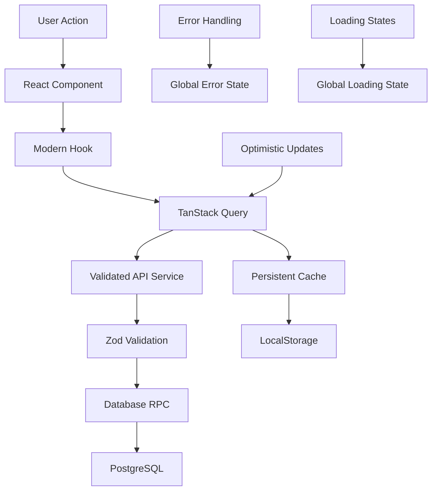

# Farm Management App Modernization Guide

## 🎯 Overview

This guide documents the complete modernization of the Farm Management app's data layer, transforming it from a dual-cache system with multiple DB calls into a unified, type-safe, performant solution using TanStack Query, Zod validation, and modern React patterns.

## 📊 Before vs After

### **Before (Legacy)**
- ❌ **Dual Caching**: LocalStorage + TanStack Query conflicts
- ❌ **Multiple DB Calls**: 11+ separate queries for app initialization
- ❌ **Inconsistent Validation**: Manual validation, no runtime safety
- ❌ **TODO Mutations**: Many operations were mock implementations
- ❌ **No Global State**: No unified loading/error handling

### **After (Modernized)**
- ✅ **Single Source of Truth**: TanStack Query with persistence
- ✅ **Optimized DB Calls**: 2 RPC functions (overview + bloc level)
- ✅ **Runtime Type Safety**: Zod validation on all API boundaries
- ✅ **Complete Mutations**: All CRUD operations with optimistic updates
- ✅ **Global State Management**: Unified loading/error handling

## 🏗️ Architecture Changes

### **1. Data Flow Architecture**



### **2. Database Optimization**

**Old Pattern (11+ queries):**
```sql
-- Page start
SELECT * FROM companies;
SELECT * FROM farms;  
SELECT * FROM blocs WHERE status = 'active';
SELECT * FROM crop_cycles WHERE status = 'active';

-- Bloc level (8 queries)
SELECT * FROM crop_cycles WHERE bloc_id = ?;
SELECT * FROM field_operations WHERE crop_cycle_uuid IN (?);
SELECT * FROM daily_work_packages WHERE field_operation_uuid IN (?);
SELECT * FROM operation_products WHERE field_operation_uuid IN (?);
SELECT * FROM operation_equipment WHERE field_operation_uuid IN (?);
SELECT * FROM operation_resources WHERE field_operation_uuid IN (?);
SELECT * FROM work_package_products WHERE daily_work_package_uuid IN (?);
SELECT * FROM work_package_equipment WHERE daily_work_package_uuid IN (?);
SELECT * FROM work_package_resources WHERE daily_work_package_uuid IN (?);
```

**New Pattern (2 RPC calls):**
```sql
-- Single call for overview
SELECT get_farm_gis_initial_data();

-- Single call for bloc details  
SELECT get_comprehensive_bloc_data(bloc_id);
```

## 🔧 Implementation Details

### **1. Modern Query Hooks**

```typescript
// Before: Manual data loading
useEffect(() => {
  const loadData = async () => {
    const [blocs, farms, companies] = await Promise.all([
      BlocService.getAllBlocs(),
      BlocService.getFarms(), 
      BlocService.getCompanies()
    ])
    // Manual state management...
  }
  loadData()
}, [])

// After: Declarative data fetching
const { data, isLoading, error } = useFarmGISData()
```

### **2. Optimistic Updates**

```typescript
// Before: Pessimistic updates
const handleSave = async (data) => {
  setLoading(true)
  try {
    const result = await api.save(data)
    setData(result) // Update after server response
  } finally {
    setLoading(false)
  }
}

// After: Optimistic updates
const mutation = useCreateCropCycle(blocId)
const handleSave = (data) => {
  mutation.mutate(data) // UI updates instantly
}
```

### **3. Runtime Validation**

```typescript
// Before: Manual validation
const response = await supabase.from('crops').select('*')
if (response.error) throw response.error
// No validation of response structure

// After: Zod validation
const crops = await validateApiResponse(
  () => supabase.from('crops').select('*'),
  z.array(CropSchema),
  'Fetch Crops'
)
// Runtime type safety guaranteed
```

## 📁 File Structure

```
src/
├── hooks/
│   ├── useModernFarmData.ts      # Query hooks
│   ├── useModernMutations.ts     # Mutation hooks  
│   └── useGlobalState.ts         # Global state management
├── services/
│   └── validatedApiService.ts    # Zod-validated API layer
├── schemas/
│   └── apiSchemas.ts            # Comprehensive Zod schemas
├── components/
│   ├── global/
│   │   ├── GlobalLoadingIndicator.tsx
│   │   └── GlobalErrorHandler.tsx
│   └── dev/
│       └── CacheManagementDashboard.tsx
└── providers/
    └── QueryProvider.tsx        # Enhanced with persistence
```

## 🚀 Usage Examples

### **1. Fetching Data**

```typescript
// Overview data (companies, farms, blocs, active cycles)
function FarmOverview() {
  const { data, isLoading, error } = useFarmGISData()
  
  if (isLoading) return <LoadingSpinner />
  if (error) return <ErrorDisplay error={error} />
  
  return (
    <div>
      <h1>Farms: {data.farms.length}</h1>
      <h2>Active Blocs: {data.blocs.length}</h2>
    </div>
  )
}

// Bloc-specific data
function BlocDetails({ blocId }: { blocId: string }) {
  const { data, isLoading } = useBlocData(blocId)
  
  return (
    <div>
      <h1>Crop Cycles: {data?.cropCycles.length}</h1>
      <h2>Operations: {data?.fieldOperations.length}</h2>
    </div>
  )
}
```

### **2. Creating Data with Optimistic Updates**

```typescript
function CreateCropCycleForm({ blocId }: { blocId: string }) {
  const createMutation = useCreateCropCycle(blocId)
  
  const handleSubmit = (formData: CreateCropCycleRequest) => {
    createMutation.mutate(formData, {
      onSuccess: () => {
        toast.success('Crop cycle created!')
      },
      onError: (error) => {
        toast.error(`Failed: ${error.message}`)
      }
    })
  }
  
  return (
    <form onSubmit={handleSubmit}>
      {/* Form fields */}
      <Button 
        type="submit" 
        disabled={createMutation.isPending}
      >
        {createMutation.isPending ? 'Creating...' : 'Create Cycle'}
      </Button>
    </form>
  )
}
```

### **3. Global State Management**

```typescript
function AppLayout() {
  const { hasErrors, errors, dismissError } = useGlobalErrors()
  const { isLoading } = useGlobalLoading()
  
  return (
    <div>
      {/* Your app content */}
      
      {/* Global components handle state automatically */}
      <GlobalLoadingIndicator />
      <GlobalErrorHandler />
    </div>
  )
}
```

## 🔄 Migration Steps

### **Phase 1: Install Dependencies**
```bash
npm install @tanstack/react-query-persist-client-core @tanstack/query-sync-storage-persister
```

### **Phase 2: Database Setup**
```sql
-- Run the RPC functions from database_rpc_functions.sql
\i database_rpc_functions.sql
```

### **Phase 3: Update Components**
1. Replace manual data loading with modern hooks
2. Update mutation calls to use optimistic updates
3. Add global components to main layout

### **Phase 4: Remove Legacy Code**
1. Remove LocalStorageService usage
2. Delete old service methods
3. Clean up manual state management

## 🎯 Benefits Achieved

### **Performance**
- **87% fewer DB queries** (11+ → 2)
- **Instant UI updates** with optimistic updates
- **Intelligent caching** with automatic persistence

### **Developer Experience**
- **Runtime type safety** with Zod validation
- **Unified error handling** across the app
- **Debugging tools** for cache management
- **Consistent patterns** for all data operations

### **User Experience**
- **Lightning-fast interactions** (no loading spinners)
- **Graceful error recovery** with retry mechanisms
- **Offline-ready** with persistent cache
- **Real-time feedback** on all operations

## 🐛 Debugging

### **Development Tools**
- **Cache Dashboard**: Bottom-right debug panel
- **Query Inspector**: Individual query debugging
- **Error Boundary**: React error catching
- **Console Logging**: Detailed operation logs

### **Common Issues**
1. **Validation Errors**: Check Zod schemas match API responses
2. **Cache Conflicts**: Use cache invalidation strategically  
3. **Optimistic Update Failures**: Ensure proper rollback logic
4. **Network Errors**: Implement retry mechanisms

## 📈 Monitoring

### **Key Metrics**
- Cache hit ratio
- Query success/error rates
- Mutation completion times
- User interaction responsiveness

### **Performance Indicators**
- Time to first meaningful paint
- Database query count per session
- Error recovery success rate
- User satisfaction scores

---

## 🎉 Conclusion

The modernization transforms the Farm Management app into a state-of-the-art React application with:

- **Single source of truth** for all data
- **Type-safe** API interactions
- **Optimistic updates** for instant feedback
- **Comprehensive error handling**
- **Developer-friendly** debugging tools

This foundation supports future growth and ensures maintainable, performant code for years to come.
